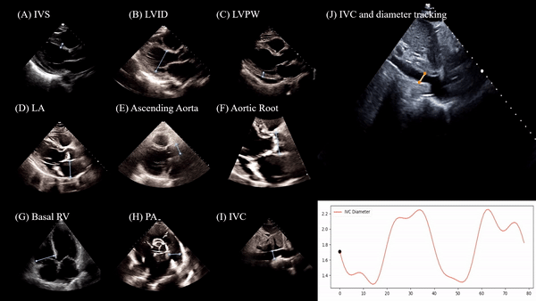

# Automatic Annotation for Echocardiography

**Project Overview**   

This project focuses on building a deep-learning model that can automatically annotate specific measurements from echocardiographic videos or images. Annotation of measurements on images is typically a time-consuming task for cardiologists and sonographer, especially with the growing volume of echocardiographic exams being performed. Automating this process has the potential to significantly improve efficiency in clinical workflows, and potentially reduce human-error, and allow high-throughput cardiovascular research using echocardiography. Our model aims to streamline this annotation process and guide parameter measurements with faster and more accurate manner.

Herein, we show gif file. Please refer `videos/EchoNet_Annotation.mp4` if you want see video file.



Key Benefits:
- Efficiency: Reducing the time needed for manual annotations.
- Scalability: Addressing the increasing number of echo exams by automating routine tasks.
- Accuracy: Providing consistent and reliable annotations of echocardiography parameters.


Model Information:
- 2D Video Model: For 2D echocardiographic videos, our model is trained and operates on videos with a resolution of 600×800.
- Doppler Image Model: For Doppler images, our model is designed to process videos at a resolution of 426×1080.
    - Why 426×1080?
    Typically, DICOM images are stored with a resolution of 768×1024 (but I think it can depend on the vendor and hospital). However, the area where Doppler information is displayed usually starts around pixel 342-344 in the vertical axis (if original is stored 768*1024). Thus, we calculate the height for the Doppler image as 426 (by subtracting 342 from 768). This ensures that the model focuses only on the relevant Doppler information, optimizing both computational resources and model performance.

## Repository Overview
This repository contains the deep learning model used for automatic annotation for 2D echo videos and Doppler images, along with the necessary code and weights to load the model and perform inference on your echo videos. Users can easily deploy the model and run predictions using the provided codes.

## Contents
1. model/: Contains the trained machine learning model for echo video annotation.
2. inference.py: Script for loading the model and running inference on input echo videos.
3. utils/: Utility functions for video preprocessing and postprocessing of annotations.


## Important Notes on Demo Videos:
Demo videos that illustrate how the model works in real-world applications. At this time, demo App are not publicly released because the data used contains personal information and Gradio does not fully comply with HIPAA (Health Insurance Portability and Accountability Act) standards. To protect patient privacy and sensitive information, we have decided not to make the demo videos publicly available. Herein, we used de-identified Dicom files for this demo.


## How to Use:
1. Clone the repository:
```sh
git clone https://github.com/your-repository-name.git
cd your-repository-name
```

2. Install dependencies:
```sh
pip install -r requirements.txt
```

3. Run inference:
```sh
python inference.py --input_video path_to_your_video
```
