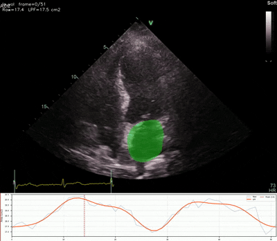
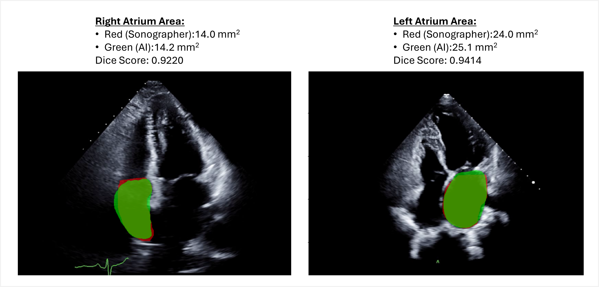
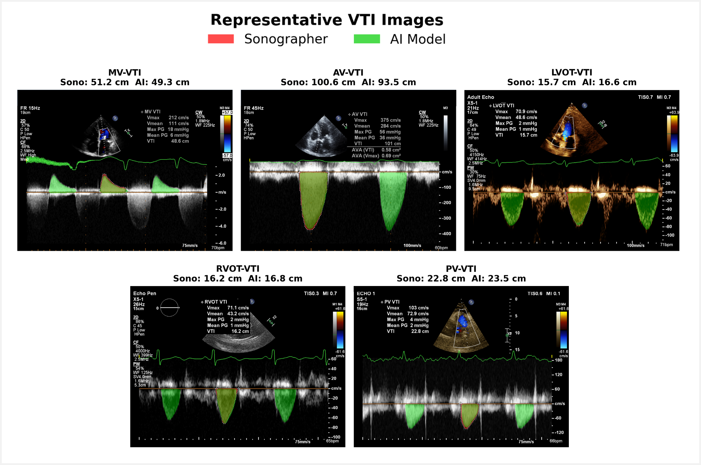
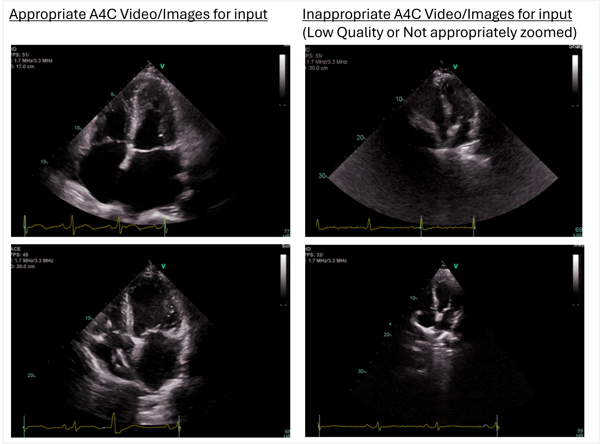

# EchoNet-Segmentation -Automatic Segmentation for Echocardiography-

## Repository Overview
This repository contains the deep learning model used for automatic segmentation of 2D echo images and Doppler images, along with the necessary code and weights to load the model and perform inference on your echo data. Users can easily run predictions using the provided codes and weights.

**Project Overview**  
This project focuses on building a deep-learning model that can automatically segment cardiac structures from echocardiographic images and Doppler waveforms. Segmentation is a fundamental step for quantitative measurements such as chamber area and velocity-time integral (VTI), tasks that are typically time-consuming for cardiologists and sonographers. Automating this process has the potential to significantly improve efficiency in clinical workflows, reduce human error, and enable high-throughput cardiovascular research using echocardiography.

**LA Segmentation — Example Inference (MIMIC)**



**Area Segmentation Echo DL vs Human**



**VTI Segmentation Echo DL vs Human**



**MV VTI — Interactive Segmentation (Streamlit Demo)**


- **Presentation**: TBD
- **Paper**: TBD


**Key Benefits in the clinical practice**:
- Efficiency: Reducing the time needed for manual segmentation.
- Scalability: Addressing the increasing number of echo exams by automating routine tasks.
- Accuracy: Providing consistent and reliable segmentation of cardiac structures and Doppler waveforms.


## Model Information:
**Area Segmentation Model (B-mode 2D Echo)**

- Backbone: deeplabv3_resnet50 (num_classes=1)
- Input resolution: 256×256
- Supported targets: `LA_AREA`, `RA_AREA`
- Weight path pattern: `weights/Area/<TARGET>/segm_weights.ckpt`

**VTI Segmentation Model (Doppler)**

- Backbone: deeplabv3_resnet50 (num_classes=1)
- Detection: YOLO (waveform peak / mountain detection)
- Input resolution: 256×256 per cropped mountain region
- Supported targets: `MV`, `AV`, `LVOT`, `RVOT`, `PV`
- Weight path pattern: `weights/VTI/<TARGET>/segm_weights.ckpt` and `weights/VTI/<TARGET>/yolo_weights.pt`

    - **Pipeline for VTI**:  
      1. Load DICOM and crop the Doppler region (y ≥ crop_y)  
      2. YOLO mountain detector → bounding boxes per waveform peak  
      3. Crop each mountain to 256×256 → DeepLabV3 segmentation  
      4. QC: reject low-quality predictions and apply area-consistency QC across mountains  
      5. Combine accepted masks and save overlay PNG

    


## Contents
1. `weights/`: Contains the trained deep learning model weights (DeepLabV3 + YOLO).
2. `inference_Area.py`: Script for loading the Area segmentation model and running inference on a single B-mode DICOM.
3. `inference_VTI.py`: Script for loading the VTI segmentation model and running inference on a single Doppler DICOM.
4. `fine_tune_Area.py`: Script for fine-tuning the Area segmentation model on your own dataset.
5. `fine_tune_VTI.py`: Script for fine-tuning the VTI segmentation model on your own dataset.
6. `utils.py`: Contains helper functions for DICOM loading, model loading, and image processing.


## How to Use:
**1. Clone the repository**:
```sh
git clone https://github.com/echonet/segmentation.git
cd your-repository-name
```

**2. Install dependencies**:

Note: we use Python 3.9 or 3.10 for training/inference.

```sh
pip install -r requirements.txt
```

Model weights are available on the **[Releases page](../../releases)** (see the right side of this repository page). Download the weights and place them under `weights/` following the directory structure shown above.

**3. Run inference**:  
- **3-1. Area Segmentation** (LA_AREA, RA_AREA)

for `--m_name`, choose from `LA_AREA` or `RA_AREA`.  
Either AVI or DICOM format works for input.

> **Input note:** The model expects apical-view B-mode images. See below for examples of appropriate input.
> 
> 

```sh
python inference_Area.py \
    --m_name LA_AREA \
    --input_file "YOUR_ECHO_DICOM_FILEPATH.dcm" \
    --output_dir "YOUR_OUTPUT_DIR/"
```

Override weights explicitly if needed:
```sh
python inference_Area.py \
    --m_name LA_AREA \
    --seg_weights weights/Area/LA_AREA/segm_weights.ckpt \
    --input_file /path/to/file.dcm
```

- **3-2. VTI Segmentation** (MV, AV, LVOT, RVOT, PV)

for `--m_name`, choose from `MV`, `AV`, `LVOT`, `RVOT`, or `PV`.  
Input should be a DICOM file since specific DICOM tag information is needed for Doppler region cropping.

```sh
python inference_VTI.py \
    --m_name MV \
    --input_file "YOUR_DOPPLER_DICOM_FILEPATH.dcm" \
    --output_dir "YOUR_OUTPUT_DIR/"
```

Override weights explicitly if needed:
```sh
python inference_VTI.py \
    --m_name MV \
    --seg_weights  weights/VTI/MV/segm_weights.ckpt \
    --yolo_weights weights/VTI/MV/yolo_weights.pt \
    --input_file   /path/to/file.dcm
```

**4. Fine-tuning**:

TBD


## Citation
If you find this code or model useful for your research, please cite our paper:

**Text**  
> TBD

**BibTeX**
```bibtex
@article{TBD}
```
